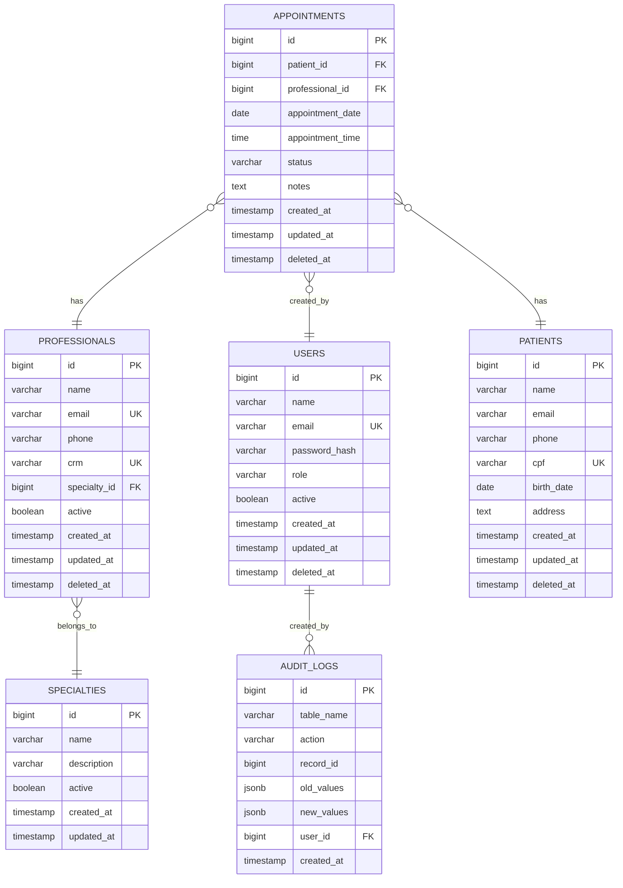

# Modelagem do Banco de Dados

Este documento descreve a estrutura completa do banco de dados do Sistema de Agendamento.

## 📋 Índice

1. [Visão Geral](#visão-geral)
2. [Diagrama ER](#diagrama-er)
3. [Tabelas](#tabelas)
4. [Relacionamentos](#relacionamentos)
5. [Índices](#índices)
6. [Constraints](#constraints)
7. [Migrações](#migrações)
8. [Dados de Seed](#dados-de-seed)

## 🏗️ Visão Geral

O banco de dados utiliza **PostgreSQL** como SGBD principal, com as seguintes características:

- **Sistema**: PostgreSQL 14+
- **Encoding**: UTF-8
- **Collation**: pt_BR.UTF-8
- **Timezone**: UTC
- **ORM**: GORM (Go)
- **Migrações**: Automáticas via GORM

### Estrutura Geral

```
agendamento_db/
├── public/
│   ├── users/           # Usuários do sistema
│   ├── professionals/   # Profissionais de saúde
│   ├── patients/        # Pacientes
│   ├── appointments/    # Consultas
│   ├── specialties/     # Especialidades médicas
│   └── audit_logs/      # Logs de auditoria
```

## 📊 Diagrama ER



## 📋 Tabelas

### 1. users

Tabela principal de usuários do sistema.

```sql
CREATE TABLE users (
    id BIGSERIAL PRIMARY KEY,
    name VARCHAR(255) NOT NULL,
    email VARCHAR(255) UNIQUE NOT NULL,
    password_hash VARCHAR(255) NOT NULL,
    role VARCHAR(50) NOT NULL DEFAULT 'user',
    active BOOLEAN DEFAULT true,
    created_at TIMESTAMP DEFAULT CURRENT_TIMESTAMP,
    updated_at TIMESTAMP DEFAULT CURRENT_TIMESTAMP,
    deleted_at TIMESTAMP NULL
);
```

**Campos:**
- `id`: Identificador único (auto-incremento)
- `name`: Nome completo do usuário
- `email`: Email único do usuário
- `password_hash`: Hash da senha (bcrypt)
- `role`: Papel do usuário (admin, doctor, patient, receptionist)
- `active`: Status ativo/inativo
- `created_at`: Data de criação
- `updated_at`: Data de atualização
- `deleted_at`: Data de exclusão (soft delete)

### 2. specialties

Tabela de especialidades médicas.

```sql
CREATE TABLE specialties (
    id BIGSERIAL PRIMARY KEY,
    name VARCHAR(255) NOT NULL UNIQUE,
    description TEXT,
    active BOOLEAN DEFAULT true,
    created_at TIMESTAMP DEFAULT CURRENT_TIMESTAMP,
    updated_at TIMESTAMP DEFAULT CURRENT_TIMESTAMP
);
```

**Campos:**
- `id`: Identificador único
- `name`: Nome da especialidade
- `description`: Descrição da especialidade
- `active`: Status ativo/inativo
- `created_at`: Data de criação
- `updated_at`: Data de atualização

### 3. professionals

Tabela de profissionais de saúde.

```sql
CREATE TABLE professionals (
    id BIGSERIAL PRIMARY KEY,
    name VARCHAR(255) NOT NULL,
    email VARCHAR(255) UNIQUE NOT NULL,
    phone VARCHAR(20),
    crm VARCHAR(20) UNIQUE,
    specialty_id BIGINT REFERENCES specialties(id),
    active BOOLEAN DEFAULT true,
    created_at TIMESTAMP DEFAULT CURRENT_TIMESTAMP,
    updated_at TIMESTAMP DEFAULT CURRENT_TIMESTAMP,
    deleted_at TIMESTAMP NULL
);
```

**Campos:**
- `id`: Identificador único
- `name`: Nome completo do profissional
- `email`: Email único do profissional
- `phone`: Telefone de contato
- `crm`: Número do CRM (único)
- `specialty_id`: Referência à especialidade
- `active`: Status ativo/inativo
- `created_at`: Data de criação
- `updated_at`: Data de atualização
- `deleted_at`: Data de exclusão (soft delete)

### 4. patients

Tabela de pacientes.

```sql
CREATE TABLE patients (
    id BIGSERIAL PRIMARY KEY,
    name VARCHAR(255) NOT NULL,
    email VARCHAR(255),
    phone VARCHAR(20),
    cpf VARCHAR(14) UNIQUE,
    birth_date DATE,
    address TEXT,
    created_at TIMESTAMP DEFAULT CURRENT_TIMESTAMP,
    updated_at TIMESTAMP DEFAULT CURRENT_TIMESTAMP,
    deleted_at TIMESTAMP NULL
);
```

**Campos:**
- `id`: Identificador único
- `name`: Nome completo do paciente
- `email`: Email do paciente
- `phone`: Telefone de contato
- `cpf`: CPF único do paciente
- `birth_date`: Data de nascimento
- `address`: Endereço completo
- `created_at`: Data de criação
- `updated_at`: Data de atualização
- `deleted_at`: Data de exclusão (soft delete)

### 5. appointments

Tabela principal de consultas.

```sql
CREATE TABLE appointments (
    id BIGSERIAL PRIMARY KEY,
    patient_id BIGINT NOT NULL REFERENCES patients(id),
    professional_id BIGINT NOT NULL REFERENCES professionals(id),
    appointment_date DATE NOT NULL,
    appointment_time TIME NOT NULL,
    status VARCHAR(50) DEFAULT 'scheduled',
    notes TEXT,
    created_by BIGINT REFERENCES users(id),
    created_at TIMESTAMP DEFAULT CURRENT_TIMESTAMP,
    updated_at TIMESTAMP DEFAULT CURRENT_TIMESTAMP,
    deleted_at TIMESTAMP NULL
);
```

**Campos:**
- `id`: Identificador único
- `patient_id`: Referência ao paciente
- `professional_id`: Referência ao profissional
- `appointment_date`: Data da consulta
- `appointment_time`: Horário da consulta
- `status`: Status da consulta (scheduled, completed, cancelled, no_show)
- `notes`: Observações da consulta
- `created_by`: Usuário que criou o agendamento
- `created_at`: Data de criação
- `updated_at`: Data de atualização
- `deleted_at`: Data de exclusão (soft delete)

### 6. audit_logs

Tabela de logs de auditoria.

```sql
CREATE TABLE audit_logs (
    id BIGSERIAL PRIMARY KEY,
    table_name VARCHAR(100) NOT NULL,
    action VARCHAR(20) NOT NULL,
    record_id BIGINT NOT NULL,
    old_values JSONB,
    new_values JSONB,
    user_id BIGINT REFERENCES users(id),
    created_at TIMESTAMP DEFAULT CURRENT_TIMESTAMP
);
```

**Campos:**
- `id`: Identificador único
- `table_name`: Nome da tabela auditada
- `action`: Ação realizada (INSERT, UPDATE, DELETE)
- `record_id`: ID do registro afetado
- `old_values`: Valores anteriores (JSON)
- `new_values`: Novos valores (JSON)
- `user_id`: Usuário que realizou a ação
- `created_at`: Data do log

## 🔗 Relacionamentos

### 1. One-to-Many

- **specialties → professionals**: Uma especialidade pode ter vários profissionais
- **patients → appointments**: Um paciente pode ter várias consultas
- **professionals → appointments**: Um profissional pode ter várias consultas
- **users → appointments**: Um usuário pode criar várias consultas
- **users → audit_logs**: Um usuário pode gerar vários logs

### 2. Foreign Keys

```sql
-- Professionals -> Specialties
ALTER TABLE professionals 
ADD CONSTRAINT fk_professionals_specialty 
FOREIGN KEY (specialty_id) REFERENCES specialties(id);

-- Appointments -> Patients
ALTER TABLE appointments 
ADD CONSTRAINT fk_appointments_patient 
FOREIGN KEY (patient_id) REFERENCES patients(id);

-- Appointments -> Professionals
ALTER TABLE appointments 
ADD CONSTRAINT fk_appointments_professional 
FOREIGN KEY (professional_id) REFERENCES professionals(id);

-- Appointments -> Users (created_by)
ALTER TABLE appointments 
ADD CONSTRAINT fk_appointments_created_by 
FOREIGN KEY (created_by) REFERENCES users(id);

-- Audit Logs -> Users
ALTER TABLE audit_logs 
ADD CONSTRAINT fk_audit_logs_user 
FOREIGN KEY (user_id) REFERENCES users(id);
```

## 📈 Índices

### Índices Primários
```sql
-- Índices automáticos para PRIMARY KEY
CREATE INDEX idx_users_id ON users(id);
CREATE INDEX idx_professionals_id ON professionals(id);
CREATE INDEX idx_patients_id ON patients(id);
CREATE INDEX idx_appointments_id ON appointments(id);
CREATE INDEX idx_specialties_id ON specialties(id);
```

### Índices de Performance
```sql
-- Índices para consultas frequentes
CREATE INDEX idx_users_email ON users(email);
CREATE INDEX idx_users_role ON users(role);
CREATE INDEX idx_users_active ON users(active);

CREATE INDEX idx_professionals_email ON professionals(email);
CREATE INDEX idx_professionals_crm ON professionals(crm);
CREATE INDEX idx_professionals_specialty ON professionals(specialty_id);
CREATE INDEX idx_professionals_active ON professionals(active);

CREATE INDEX idx_patients_email ON patients(email);
CREATE INDEX idx_patients_cpf ON patients(cpf);
CREATE INDEX idx_patients_name ON patients(name);

CREATE INDEX idx_appointments_patient ON appointments(patient_id);
CREATE INDEX idx_appointments_professional ON appointments(professional_id);
CREATE INDEX idx_appointments_date ON appointments(appointment_date);
CREATE INDEX idx_appointments_status ON appointments(status);
CREATE INDEX idx_appointments_datetime ON appointments(appointment_date, appointment_time);
CREATE INDEX idx_appointments_created_by ON appointments(created_by);

CREATE INDEX idx_audit_logs_table ON audit_logs(table_name);
CREATE INDEX idx_audit_logs_action ON audit_logs(action);
CREATE INDEX idx_audit_logs_user ON audit_logs(user_id);
CREATE INDEX idx_audit_logs_created_at ON audit_logs(created_at);
```

### Índices Compostos
```sql
-- Índices compostos para consultas complexas
CREATE INDEX idx_appointments_professional_date ON appointments(professional_id, appointment_date);
CREATE INDEX idx_appointments_patient_date ON appointments(patient_id, appointment_date);
CREATE INDEX idx_appointments_status_date ON appointments(status, appointment_date);
```

## 🔒 Constraints

### Constraints de Validação
```sql
-- Validar email
ALTER TABLE users ADD CONSTRAINT chk_users_email CHECK (email ~* '^[A-Za-z0-9._%+-]+@[A-Za-z0-9.-]+\.[A-Za-z]{2,}$');
ALTER TABLE professionals ADD CONSTRAINT chk_professionals_email CHECK (email ~* '^[A-Za-z0-9._%+-]+@[A-Za-z0-9.-]+\.[A-Za-z]{2,}$');
ALTER TABLE patients ADD CONSTRAINT chk_patients_email CHECK (email IS NULL OR email ~* '^[A-Za-z0-9._%+-]+@[A-Za-z0-9.-]+\.[A-Za-z]{2,}$');

-- Validar CPF
ALTER TABLE patients ADD CONSTRAINT chk_patients_cpf CHECK (cpf ~* '^\d{3}\.\d{3}\.\d{3}-\d{2}$');

-- Validar telefone
ALTER TABLE professionals ADD CONSTRAINT chk_professionals_phone CHECK (phone ~* '^\(\d{2}\) \d{4,5}-\d{4}$');
ALTER TABLE patients ADD CONSTRAINT chk_patients_phone CHECK (phone IS NULL OR phone ~* '^\(\d{2}\) \d{4,5}-\d{4}$');

-- Validar status de consulta
ALTER TABLE appointments ADD CONSTRAINT chk_appointments_status CHECK (status IN ('scheduled', 'completed', 'cancelled', 'no_show'));

-- Validar role de usuário
ALTER TABLE users ADD CONSTRAINT chk_users_role CHECK (role IN ('admin', 'doctor', 'patient', 'receptionist'));

-- Validar data de nascimento
ALTER TABLE patients ADD CONSTRAINT chk_patients_birth_date CHECK (birth_date <= CURRENT_DATE);

-- Validar data de consulta
ALTER TABLE appointments ADD CONSTRAINT chk_appointments_date CHECK (appointment_date >= CURRENT_DATE);
```

### Constraints de Unicidade
```sql
-- Emails únicos
ALTER TABLE users ADD CONSTRAINT uk_users_email UNIQUE (email);
ALTER TABLE professionals ADD CONSTRAINT uk_professionals_email UNIQUE (email);

-- CPF único
ALTER TABLE patients ADD CONSTRAINT uk_patients_cpf UNIQUE (cpf);

-- CRM único
ALTER TABLE professionals ADD CONSTRAINT uk_professionals_crm UNIQUE (crm);

-- Nome de especialidade único
ALTER TABLE specialties ADD CONSTRAINT uk_specialties_name UNIQUE (name);
```

## 🔄 Migrações

### Estrutura de Migrações
```
backend/
├── migrations/
│   ├── 001_create_users.sql
│   ├── 002_create_specialties.sql
│   ├── 003_create_professionals.sql
│   ├── 004_create_patients.sql
│   ├── 005_create_appointments.sql
│   ├── 006_create_audit_logs.sql
│   ├── 007_add_indexes.sql
│   └── 008_add_constraints.sql
```

### Exemplo de Migração
```sql
-- Migration: 001_create_users.sql
BEGIN;

CREATE TABLE users (
    id BIGSERIAL PRIMARY KEY,
    name VARCHAR(255) NOT NULL,
    email VARCHAR(255) UNIQUE NOT NULL,
    password_hash VARCHAR(255) NOT NULL,
    role VARCHAR(50) NOT NULL DEFAULT 'user',
    active BOOLEAN DEFAULT true,
    created_at TIMESTAMP DEFAULT CURRENT_TIMESTAMP,
    updated_at TIMESTAMP DEFAULT CURRENT_TIMESTAMP,
    deleted_at TIMESTAMP NULL
);

CREATE INDEX idx_users_email ON users(email);
CREATE INDEX idx_users_role ON users(role);

COMMIT;
```

## 🌱 Dados de Seed

### Usuários Padrão
```sql
-- Inserir usuários padrão
INSERT INTO users (name, email, password_hash, role) VALUES
('Administrador', 'admin@agendamento.com', '$2a$10$...', 'admin'),
('Médico Teste', 'medico@agendamento.com', '$2a$10$...', 'doctor'),
('Paciente Teste', 'paciente@agendamento.com', '$2a$10$...', 'patient'),
('Recepcionista', 'recepcao@agendamento.com', '$2a$10$...', 'receptionist');
```

### Especialidades
```sql
-- Inserir especialidades padrão
INSERT INTO specialties (name, description) VALUES
('Clínico Geral', 'Medicina clínica geral'),
('Cardiologia', 'Especialidade do coração'),
('Dermatologia', 'Especialidade da pele'),
('Ortopedia', 'Especialidade dos ossos e articulações'),
('Pediatria', 'Medicina infantil'),
('Ginecologia', 'Saúde da mulher'),
('Neurologia', 'Especialidade do sistema nervoso'),
('Psiquiatria', 'Saúde mental');
```

### Profissionais
```sql
-- Inserir profissionais padrão
INSERT INTO professionals (name, email, phone, crm, specialty_id) VALUES
('Dr. João Silva', 'joao.silva@clinica.com', '(11) 99999-9999', '12345-SP', 1),
('Dra. Maria Santos', 'maria.santos@clinica.com', '(11) 88888-8888', '54321-SP', 2),
('Dr. Pedro Costa', 'pedro.costa@clinica.com', '(11) 77777-7777', '67890-SP', 3);
```

## 📊 Views Úteis

### View de Consultas com Detalhes
```sql
CREATE VIEW v_appointments_details AS
SELECT 
    a.id,
    a.appointment_date,
    a.appointment_time,
    a.status,
    a.notes,
    p.name as patient_name,
    p.email as patient_email,
    p.phone as patient_phone,
    pr.name as professional_name,
    pr.email as professional_email,
    s.name as specialty_name,
    u.name as created_by_name
FROM appointments a
JOIN patients p ON a.patient_id = p.id
JOIN professionals pr ON a.professional_id = pr.id
JOIN specialties s ON pr.specialty_id = s.id
LEFT JOIN users u ON a.created_by = u.id
WHERE a.deleted_at IS NULL;
```

### View de Relatórios
```sql
CREATE VIEW v_appointments_report AS
SELECT 
    DATE(appointment_date) as date,
    COUNT(*) as total_appointments,
    COUNT(CASE WHEN status = 'completed' THEN 1 END) as completed,
    COUNT(CASE WHEN status = 'cancelled' THEN 1 END) as cancelled,
    COUNT(CASE WHEN status = 'no_show' THEN 1 END) as no_show
FROM appointments
WHERE deleted_at IS NULL
GROUP BY DATE(appointment_date)
ORDER BY date DESC;
```

## 🔧 Manutenção

### Comandos de Manutenção
```sql
-- Analisar tabelas
ANALYZE users;
ANALYZE professionals;
ANALYZE patients;
ANALYZE appointments;

-- Vacuum (limpeza)
VACUUM ANALYZE;

-- Verificar tamanho das tabelas
SELECT 
    schemaname,
    tablename,
    attname,
    n_distinct,
    correlation
FROM pg_stats
WHERE tablename IN ('users', 'professionals', 'patients', 'appointments');
```

### Backup e Restore
```bash
# Backup completo
pg_dump -h localhost -U postgres agendamento > backup.sql

# Backup apenas estrutura
pg_dump -h localhost -U postgres --schema-only agendamento > schema.sql

# Restore
psql -h localhost -U postgres agendamento < backup.sql
```